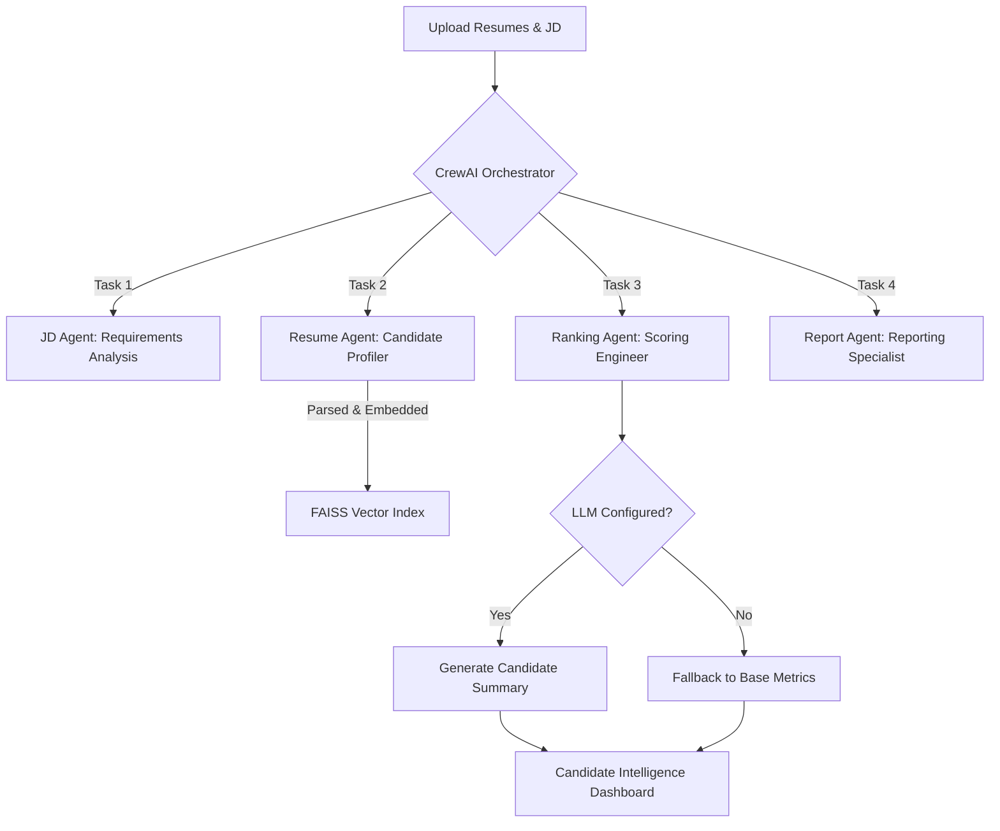

# AI Resume Intelligence Agent

## 1. Project Overview
AI Resume Intelligence Agent is a professional, internship-level engineering project designed to automate the initial screening and ranking of candidate resumes. Built with a deterministic-first philosophy, the system reliably parses resumes, matches them against job descriptions (JDs) using semantic search, and optionally leverages an LLM to generate explainable candidate insights for recruiters.

## 2. Features
- **Deterministic Parsing:** High-fidelity rule-based extraction of resume sections and metadata.
- **Semantic Ranking:** Vector-based candidate matching against Job Descriptions using Sentence Transformers and FAISS.
- **LLM-Assisted Intelligence:** Optional, fail-safe LLM integration to generate recruiter-friendly summaries and highlight strengths/missing skills.
- **Explainable Scoring:** Transparent confidence scores and recommendation logic that trace back to the raw resume data.
- **Export Capabilities:** One-click JSON, CSV, and PDF exports for seamless sharing.

## 3. Tech Stack
- **Frontend / UI:** Streamlit (SaaS-style layout)
- **Document Parsing:** PyMuPDF (fitz)
- **Vector Search:** FAISS (CPU)
- **Embeddings:** Sentence Transformers (`all-MiniLM-L6-v2`)
- **LLM Integration:**Groq (Llama 3)
- **Testing:** Pytest
## Technical Decision Log

| Component | Choice | Reason |
|---|---|---|
| LLM |  Gemini / Groq-compatible providers | Fast inference, free, strong summarization |
| Embeddings | all-MiniLM-L6-v2 | Lightweight, fast CPU inference |
| Vector Store | FAISS | Efficient semantic similarity search |
| Framework | CrewAI | Lightweight orchestration wrapper for modular agents |
| UI | Streamlit | Rapid prototyping and recruiter-friendly interface |
| Parsing | PyMuPDF | Reliable PDF extraction performance |
## Supported Inputs
- PDF resumes
- Structured LinkedIn JSON profiles
- Plain-text Job Descriptions

- **Structured Output Pipeline:** Candidate and JD schemas are normalized into structured Python/Pydantic-compatible representations for reliable downstream scoring and export.
## 4. Architecture



The system uses a **lightweight CrewAI orchestration wrapper** around the existing deterministic backend. This enforces a strict, sequential agent workflow (JD Agent → Resume Agent → Ranking Agent → Report Agent) while avoiding unstable autonomous execution, maintaining explainability, and allowing seamless ingestion of both PDF resumes and structured LinkedIn JSON profiles.

## 5. Recruiter Workflow
1. **Upload:** A recruiter uploads a JD and a batch of PDF resumes.
2. **Analyze:** The system parses, chunks, and embeds the documents.
3. **Rank:** Candidates are semantically ranked against the JD.
4. **Review:** The recruiter reviews the Candidate Intelligence dashboard to see strengths, missing skills, and overall recommendations.
5. **Export:** The final shortlist is exported as a JSON payload, CSV, or PDF report.

## 6. AI/LLM Pipeline
The LLM pipeline is strictly separated from the retrieval engine to guarantee stability. It acts purely as a summarization tool, interpreting the semantic matches found by FAISS. By default, the system runs with a `mock` provider, ensuring zero dependencies on external APIs unless explicitly configured. If an API key is missing or the provider fails, the system safely falls back without crashing the UI.

## 7. Ranking Pipeline
Rankings are generated by comparing the JD embeddings against section-wise resume chunks. The system prioritizes exact skill matches and semantic proximity, avoiding black-box LLM decision-making to maintain explainability and consistency.

## 8. Security Mitigations
This project takes a deterministic-first approach to security, ensuring that AI enhances rather than controls the workflow.

- **Data Privacy & Local Processing:** All primary parsing, semantic chunking, embedding (`sentence-transformers`), and FAISS vector retrieval are executed completely locally. Candidate data is never exposed to the public internet for the core ranking engine.
- **Deterministic Ranking Safeguards:** The scoring engine relies purely on math (cosine similarity against exact chunks). Rankings cannot be manipulated or hallucinated by LLM prompt injections.
- **API Key Protection:** The `.env` file containing API keys is strictly ignored in version control (`.gitignore`), and the `.env.example` provides safe templates.
- **Prompt Injection Mitigation:** The LLM is used *only* as a read-only summarization layer applied at the very end of the pipeline. It is not provided with function-calling capabilities or write access. 
- **Graceful Failures:** The LLM integration is non-blocking. If API quotas are exhausted, keys are missing, or requests timeout, the system degrades gracefully into fallback deterministic text without crashing the UI.
- **Human-in-the-Loop:** All outputs generated by the Agent are presented to a recruiter through the UI for manual override and review.

## 9. Setup Instructions
1. Clone the repository.
2. Create a virtual environment: `python -m venv venv`
3. Activate the environment: `venv\Scripts\activate` (Windows) or `source venv/bin/activate` (Mac/Linux).
4. Install dependencies: `pip install -r requirements.txt`

## 10. Environment Variables
Copy `.env.example` to `.env` and configure your API keys (optional).
```bash
cp .env.example .env
```
_Note: Do not commit your `.env` file. Never expose secrets._

## 11. Running Locally
Launch the Streamlit app:
```bash
streamlit run main.py
```
Run tests:
```bash
python -m pytest
```

## 12. Screenshots

- ``
- ``
- ``

## 13. Demo Instructions
To run a quick demo without external API keys:
1. Keep the `LLM_PROVIDER=mock` in your `.env`.
2. Upload any PDF resume and text JD.
3. Observe the deterministic ranking and safe fallback summaries.

## 14. Future Improvements
- Pluggable support for local, open-source LLMs (e.g., Llama 3 via Ollama).
- Advanced OCR integration for image-based PDFs.
- Enhanced analytics tracking candidate conversion rates.
