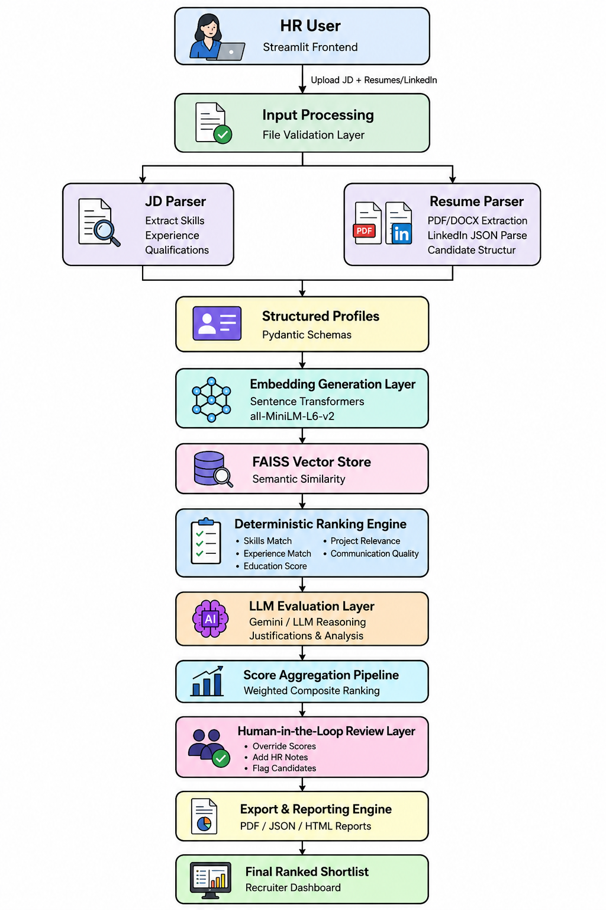

# AI Resume Intelligence Agent



---

# 1. Project Overview

AI Resume Intelligence Agent is a professional internship-level AI engineering project designed to automate the initial screening, semantic evaluation, and ranking of candidate resumes against Job Descriptions (JDs).

Traditional resume screening is:
- repetitive,
- time-consuming,
- inconsistent across recruiters,
- difficult to scale for large applicant pools.

This project solves that problem using a deterministic-first AI pipeline that combines:
- semantic search,
- embeddings,
- vector retrieval,
- explainable scoring,
- optional LLM reasoning,
- recruiter review workflows.

Unlike purely LLM-driven resume screening systems, this project prioritizes:
- deterministic semantic retrieval,
- explainable ranking,
- human-in-the-loop validation,
- stable and reproducible scoring.

The system is designed to assist recruiters — not replace them.

---

# 2. Problem Statement

Recruiters often manually review hundreds of resumes for a single role.

This creates several major challenges:

- Inconsistent candidate evaluation
- Recruiter fatigue
- Difficulty identifying strong candidates quickly
- Hidden semantic matches missed by keyword filtering
- Lack of explainability in AI-generated rankings
- Hallucination risks in purely LLM-based systems
- Security and privacy concerns when processing candidate data

Most existing AI resume screening systems rely heavily on black-box LLM decisions, making them:
- difficult to trust,
- difficult to explain,
- difficult to validate.

This project addresses those limitations through a deterministic-first architecture.

---

# 3. Our Approach

The project follows a hybrid AI engineering approach:

```text
Deterministic Parsing
        +
Semantic Embedding Retrieval
        +
Vector Similarity Search
        +
Explainable Scoring
        +
Optional LLM Summarization

Instead of allowing the LLM to directly control candidate rankings, the system:

Parses resumes deterministically
Generates semantic embeddings
Uses FAISS vector search for similarity matching
Computes weighted rubric-based scores
Uses the LLM only for recruiter-friendly explanations

This architecture:

improves explainability,
reduces hallucination risks,
maintains scoring consistency,
supports graceful failure handling.

Recruiters always retain final decision authority through a human-in-the-loop workflow.

4. Features
Deterministic Resume Parsing
High-fidelity extraction of resume sections and metadata.
Semantic Candidate Matching
Embedding-based candidate ranking using Sentence Transformers and FAISS.
Explainable AI Ranking
Transparent weighted scoring pipeline instead of black-box LLM scoring.
LLM-Assisted Intelligence
Optional Gemini-powered recruiter summaries and insights.
Human-in-the-Loop Review
Recruiters can manually review and override candidate decisions.
Structured Output Pipeline
Candidate and JD schemas are normalized into structured representations for reliable scoring and export.
Safe Failure Handling
System gracefully falls back when LLM APIs fail or keys are missing.
Export Capabilities
JSON, CSV, and PDF recruiter reports.
5. Supported Inputs

The system currently supports:

PDF resumes
Structured LinkedIn JSON profile data
Plain-text Job Descriptions (JDs)
6. Tech Stack
Layer	Technology
Frontend / UI	Streamlit
Resume Parsing	PyMuPDF (fitz)
Embeddings	Sentence Transformers (all-MiniLM-L6-v2)
Vector Search	FAISS (CPU)
LLM Integration	Gemini 1.5 Flash
Agent Framework	CrewAI
Testing	Pytest
Reporting	JSON / CSV / PDF
Language	Python
7. Technical Decision Log
Component	Choice	Reason
LLM	Gemini 1.5 Flash	Fast inference, low cost, strong summarization
Embeddings	all-MiniLM-L6-v2	Lightweight and efficient semantic embeddings
Vector Store	FAISS	Fast similarity search for semantic retrieval
Framework	CrewAI	Lightweight orchestration wrapper for modular agents
UI	Streamlit	Rapid development and recruiter-friendly interface
Parsing Engine	PyMuPDF	Reliable PDF extraction performance
Ranking Strategy	Deterministic-first	Improved explainability and reduced hallucination risk
8. System Architecture
9. Detailed Pipeline Flow
Recruiter Uploads:
    - Job Description
    - Resume Batch
            ↓

JD Parsing Layer
    - Skills extraction
    - Experience extraction
    - Qualification extraction
            ↓

Resume Parsing Layer
    - PDF extraction
    - Candidate section parsing
    - Structured candidate profiles
            ↓

Embedding Layer
    - SentenceTransformer embeddings
            ↓

FAISS Semantic Search
    - Similarity retrieval
    - Candidate matching
            ↓

Deterministic Ranking Engine
    - Skills match
    - Experience score
    - Project relevance
    - Communication quality
            ↓

Optional LLM Summarization
    - Recruiter-friendly insights
    - Missing skill analysis
            ↓

Recruiter Dashboard
            ↓

Export Reports
    - PDF
    - JSON
    - CSV
10. CrewAI Agent Workflow

The system uses a lightweight CrewAI orchestration wrapper around the deterministic backend.

Agents used in the pipeline:

Agent	Responsibility
JD Agent	Extracts structured JD requirements
Resume Agent	Parses and structures candidate resumes
Ranking Agent	Computes weighted candidate rankings
Report Agent	Generates recruiter-friendly outputs

The orchestration remains intentionally deterministic and sequential to maintain:

explainability,
reproducibility,
system stability.

The project avoids unstable autonomous agent loops.

11. Recruiter Workflow
Recruiter uploads a JD and resume batch.
The system parses and structures all documents.
Candidate embeddings are generated.
Semantic similarity search retrieves relevant matches.
Deterministic ranking computes weighted candidate scores.
Optional LLM summaries provide recruiter insights.
Recruiter reviews the dashboard and exports reports.

Recruiters always retain final decision authority.

12. AI / LLM Pipeline

The LLM layer is intentionally separated from the retrieval and ranking engine.

The LLM:

does NOT directly control candidate rankings,
does NOT override deterministic scores,
acts purely as a summarization layer.

This architecture improves:

trust,
explainability,
reliability,
recruiter transparency.

If:

API keys are missing,
quotas are exhausted,
requests fail,

the system gracefully falls back to deterministic outputs without crashing.

13. Ranking Pipeline

Candidate rankings are generated using:

semantic embedding similarity,
weighted rubric scoring,
deterministic evaluation logic.

The system evaluates:

skills match,
experience relevance,
project relevance,
semantic proximity,
communication quality.

The ranking pipeline intentionally avoids black-box AI decision-making.

14. Security Mitigations

This project follows a deterministic-first security philosophy.

Data Privacy & Local Processing
Resume parsing,
chunking,
embeddings,
FAISS retrieval

all execute locally.

Candidate data is not exposed externally for the core ranking engine.

Prompt Injection Mitigation

The LLM:

operates only as a read-only summarization layer,
has no function-calling permissions,
cannot modify rankings or access system controls.
API Key Protection
.env is ignored via .gitignore
.env.example provides safe templates
secrets are never hardcoded
Hallucination Reduction

The system relies primarily on:

deterministic parsing,
mathematical similarity scoring,
semantic retrieval,

instead of uncontrolled LLM reasoning.

Graceful Failure Handling

If:

APIs fail,
keys are missing,
quotas are exceeded,

the system safely falls back without breaking the recruiter workflow.

Human-in-the-Loop Safety

All outputs are reviewed by recruiters before final decisions.

AI assists recruiters — it does not replace them.

15. Setup Instructions
Clone Repository
git clone https://github.com/Adityaraj614/AI-Resume-Intelligence-Agent.git
cd AI-Resume-Intelligence-Agent
Create Virtual Environment
Windows
python -m venv venv
venv\Scripts\activate
Linux / Mac
python3 -m venv venv
source venv/bin/activate
Install Dependencies
pip install -r requirements.txt
16. Environment Variables

Copy .env.example to .env

cp .env.example .env

Configure your API keys if using external LLM providers.

Example:

GOOGLE_API_KEY=your_api_key_here
LLM_PROVIDER=gemini

Never commit your .env file.

17. Running Locally

Launch the Streamlit application:

streamlit run main.py

Run tests:

python -m pytest
18. Screenshots
Main Dashboard

Candidate Rankings

Recruiter Analytics

Export Workflow

19. Sample Outputs

The repository includes sample recruiter deliverables:

sample_outputs/sample_recruiter_report.pdf
sample_outputs/sample_shortlist.json

These demonstrate:

explainable rankings,
recruiter summaries,
export capabilities,
deterministic scoring outputs.
20. Demo Instructions

To run the project without external API dependencies:

Keep:
LLM_PROVIDER=mock
Upload:
a sample resume PDF,
a text-based Job Description.
Observe:
deterministic semantic ranking,
explainable scoring,
recruiter dashboard generation,
safe fallback summaries.
21. Future Improvements
DOCX resume parsing support
Local LLM support via Ollama
OCR support for scanned/image-based resumes
Recruiter feedback learning loops
SQLite/PostgreSQL persistence
LangSmith / Langfuse observability
Advanced analytics dashboards
Multi-role hiring pipeline support
22. Project Goals

This project was designed to demonstrate:

AI engineering workflows
semantic retrieval systems
explainable AI pipelines
human-in-the-loop AI design
secure LLM integration
production-oriented architecture
modular AI agent orchestration

The goal was not to build a chatbot, but to engineer a reliable AI-assisted recruiter workflow system.
